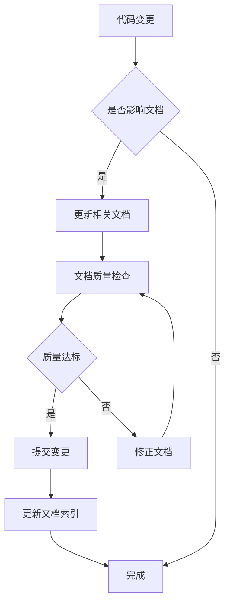

# 文档维护指南

本文档定义了 STEREOWOOD Color System 的文档维护标准和更新机制，确保文档与代码保持同步，为AI和人类开发者提供准确、完整的项目信息。

## 📋 文档结构标准

### 文档分类体系

```
docs/
├── deployment/          # 部署相关 - 面向运维人员
│   ├── README.md       # 部署文档索引
│   └── DEPLOYMENT.md   # 详细部署指南
├── development/         # 开发相关 - 面向开发者  
│   ├── README.md       # 开发文档索引
│   ├── DESIGN_SYSTEM.md         # UI设计系统
│   ├── REFACTORING_SUMMARY.md   # 重构历史记录
│   └── ARTWORKS_REFACTORING_PLAN.md # 组件重构计划
├── features/           # 功能特性 - 面向功能维护者
│   ├── README.md       # 功能文档索引
│   ├── FORMULA-CALCULATOR.md    # 配方计算器
│   └── duplicate-detection.md   # 查重检测系统
├── architecture/       # 架构设计 - 面向架构师
│   ├── README.md       # 架构文档索引
│   ├── overview.md     # 系统架构总览 (计划中)
│   ├── database-design.md       # 数据库设计 (计划中)
│   └── api-specification.md     # API规范 (计划中)
└── DOCUMENTATION_GUIDE.md       # 文档维护指南 (本文档)
```

### 文档命名规范

| 文档类型 | 命名模式 | 示例 | 说明 |
|---------|---------|------|------|
| **索引文档** | `README.md` | `deployment/README.md` | 每个目录的入口文档 |
| **功能设计** | `FEATURE-NAME.md` | `FORMULA-CALCULATOR.md` | 全大写，连字符分割 |
| **技术规范** | `kebab-case.md` | `duplicate-detection.md` | 小写，连字符分割 |
| **指南文档** | `CATEGORY_GUIDE.md` | `DOCUMENTATION_GUIDE.md` | 大写+下划线 |

## 📝 文档内容标准

### 通用文档模板

#### 功能设计文档模板
```markdown
# [功能名称] 设计文档

> **状态**: ✅ 已完成 / 🔄 开发中 / 📋 计划中  
> **维护者**: @username  
> **最后更新**: YYYY-MM-DD

## 📋 概述

### 🎯 功能目标
- 明确的功能目标描述
- 解决的具体问题

### 📊 核心指标
- 性能指标
- 用户体验指标

## 🏗️ 技术设计

### 架构图
```text
[ASCII 架构图或流程图]
```

### 核心算法
```javascript
// 关键算法的伪代码或核心逻辑
```

### 数据结构
```typescript  
// 接口定义和数据结构
```

## 🎨 用户交互

### 界面设计
- UI布局说明
- 交互流程图

### 用户操作流程
1. 第一步操作
2. 第二步操作
3. ...

## 🧪 测试用例

### 功能测试
| 测试场景 | 操作步骤 | 预期结果 | 状态 |
|---------|---------|----------|------|
| 场景1 | 步骤1 -> 步骤2 | 预期结果 | ✅ 通过 |

### 性能测试
- 性能基准
- 测试方法

## 🚨 已知问题

### 当前限制
1. 限制1的描述和影响
2. 限制2的描述和影响

### 技术债务
- [ ] 待解决问题1
- [ ] 待解决问题2

## 📅 更新记录

### v1.2.0 (2025-XX-XX)
- 变更内容1
- 变更内容2

### v1.1.0 (2025-XX-XX)  
- 历史变更记录
```

#### API文档模板
```markdown
# API 接口文档

## 接口概述
- **接口名称**: 接口功能描述
- **请求方法**: GET/POST/PUT/DELETE
- **请求路径**: `/api/endpoint`
- **权限要求**: 无/需要认证

## 请求参数

### 路径参数
| 参数名 | 类型 | 必填 | 说明 |
|--------|------|------|------|
| id | number | 是 | 记录ID |

### 查询参数  
| 参数名 | 类型 | 必填 | 默认值 | 说明 |
|--------|------|------|--------|------|
| page | number | 否 | 1 | 页码 |

### 请求体
```json
{
  "field1": "value1",
  "field2": "value2"
}
```

## 响应格式

### 成功响应 (200)
```json
{
  "success": true,
  "data": {},
  "message": "操作成功"
}
```

### 错误响应 (4xx/5xx)
```json  
{
  "success": false,
  "error": "错误码",
  "message": "错误描述"
}
```

## 示例代码

### JavaScript/Axios
```javascript
const response = await axios.post('/api/endpoint', {
  field1: 'value1'
});
```
```

### 文档质量检查清单

#### ✅ 内容完整性
- [ ] **目标明确**: 文档目标和使用场景清晰
- [ ] **信息完整**: 所有必要信息都已包含
- [ ] **示例充分**: 提供足够的代码示例
- [ ] **测试用例**: 包含可验证的测试用例

#### ✅ 技术准确性
- [ ] **代码正确**: 所有代码示例经过验证
- [ ] **版本一致**: 与当前代码版本保持同步
- [ ] **链接有效**: 所有内部外部链接可访问
- [ ] **依赖正确**: 依赖关系描述准确

#### ✅ 可读性和可维护性
- [ ] **结构清晰**: 使用统一的标题层级和格式
- [ ] **语言简洁**: 避免冗长和模糊的描述  
- [ ] **导航便捷**: 提供清晰的目录和链接
- [ ] **更新及时**: 包含最新的更新记录

## 🔄 文档更新流程

### 更新触发条件

#### 代码变更触发
1. **新功能开发**: 功能开发完成前必须更新文档
2. **Bug修复**: 重要bug修复需要更新相关文档
3. **架构变更**: 任何架构级别的变更都需要文档更新
4. **API变更**: 接口变更必须同步更新API文档

#### 定期更新
1. **月度检查**: 每月检查文档的准确性和完整性
2. **版本发布**: 每个版本发布时更新版本记录
3. **季度审查**: 每季度进行文档架构和内容的全面审查

### 更新责任分工

| 角色 | 文档责任 | 更新频率 |
|------|---------|----------|
| **功能开发者** | 功能设计文档、API文档 | 功能变更时 |
| **架构师** | 架构设计、技术决策记录 | 架构变更时 |
| **项目维护者** | 项目README、更新记录 | 版本发布时 |
| **AI助手** | 文档格式规范、内容审查 | 持续维护 |

### 更新工作流



## 🤖 AI友好的文档规范

### 结构化信息

#### 使用标准化的元数据
```markdown
---
title: "配方计算器设计文档"
description: "配方用量快速计算模块的详细设计"
version: "1.2.0"
status: "completed"
maintainer: "AI Assistant"
last_updated: "2025-08-26"
dependencies: ["FormulaParser", "createCalcStore"]
related_docs: ["duplicate-detection.md", "DESIGN_SYSTEM.md"]
---
```

#### 使用明确的标签系统
- **🎯 目标和范围**: 使用此标签标识功能目标
- **🏗️ 技术实现**: 标识技术细节和实现方案
- **🧪 测试验证**: 标识测试相关内容
- **🚨 注意事项**: 标识限制、问题和注意事项
- **📅 时间信息**: 标识版本历史和时间线

### 上下文信息

#### 明确的依赖关系
```markdown
## 📋 依赖关系

### 前置依赖
- **FormulaParser**: 配方解析引擎
- **Element Plus**: UI组件库

### 影响范围
- **custom-colors.js**: 自配色管理组件
- **artworks.js**: 作品管理组件

### 相关文档
- [配方解析器设计](formula-parser.md)
- [UI设计系统](DESIGN_SYSTEM.md)
```

#### 决策记录模板
```markdown
## 🔍 设计决策

### 决策001: 状态持久化方案
- **问题**: 计算状态在页面刷新后丢失
- **方案选择**: localStorage + 防抖写入
- **选择原因**: 
  1. 无需服务端支持
  2. 性能开销小
  3. 用户体验好
- **权衡考虑**: 
  - 优点: 实现简单，响应快速
  - 缺点: 浏览器兼容性，存储限制
- **影响范围**: calc-store.js模块
```

## 📚 文档版本管理

### 版本控制策略
- **文档版本**: 跟随功能版本，使用语义化版本号
- **变更追踪**: 每次更新记录变更内容和原因
- **向后兼容**: 重大变更提供迁移指南

### 文档归档策略
- **当前版本**: 保持最新和准确
- **历史版本**: 重要的历史决策和设计保留在更新记录中
- **废弃标记**: 过时的功能和API使用醒目标记

## 🎯 质量保证

### 自动化检查(计划中)
- **链接检查**: 定期检查内部和外部链接的有效性
- **格式检查**: 检查markdown格式和标题层级
- **内容同步**: 检查代码注释和文档的一致性

### 手动审查流程
1. **功能完整性**: 确保所有功能都有相应文档
2. **准确性验证**: 测试所有代码示例和操作步骤
3. **可用性测试**: 从用户角度检查文档的可用性
4. **定期更新**: 按照更新计划进行文档维护

---

## 📋 维护检查清单

### 新功能开发时
- [ ] 编写功能设计文档
- [ ] 更新相关API文档  
- [ ] 更新项目README索引
- [ ] 更新依赖关系图

### 版本发布时
- [ ] 更新版本记录
- [ ] 检查所有文档链接
- [ ] 更新安装和部署指南
- [ ] 同步代码注释

### 定期维护时
- [ ] 检查文档准确性
- [ ] 更新过时信息
- [ ] 优化文档结构
- [ ] 收集用户反馈

---

**文档维护是持续过程，需要所有贡献者共同努力保持项目文档的高质量和时效性。**

---

**返回**: [📚 主文档](../README.md) | **相关**: [🛠️ 开发文档](development/) | **工具**: [🎨 设计系统](development/DESIGN_SYSTEM.md)