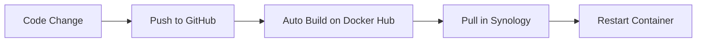

# Synology NAS Deployment Guide

## 🚀 Quick Overview
Deploy STEREOWOOD Color System to your Synology NAS using Container Manager (formerly Docker).

## 📋 Prerequisites

### 1. Synology Setup
- [ ] DSM 7.0+ installed
- [ ] Container Manager installed from Package Center
- [ ] At least 2GB free RAM
- [ ] 1GB free storage space

### 2. Network Setup
- [ ] Synology DDNS configured
- [ ] Router port forwarding to Synology
- [ ] Reverse Proxy configured in DSM

### 3. Docker Hub Account
- [ ] Create account at https://hub.docker.com
- [ ] Repository: `yourusername/stereowood-color-system`

## 🔧 Initial Setup

### Step 1: GitHub Repository Setup
1. Fork/Clone the repository to your GitHub
2. Go to Settings → Secrets → Actions
3. Add these secrets:
   ```
   DOCKER_HUB_USERNAME: your-dockerhub-username
   DOCKER_HUB_TOKEN: your-dockerhub-access-token
   ```

### Step 2: Docker Hub Access Token
1. Login to Docker Hub
2. Account Settings → Security → New Access Token
3. Name: "Synology Deployment"
4. Copy token to GitHub secrets

### Step 3: First Build
1. Push code to GitHub main branch
2. GitHub Actions will automatically build and push to Docker Hub
3. Wait for build completion (check Actions tab)

## 📦 Synology Container Manager Setup

### Step 1: Pull Image
1. Open Container Manager
2. Go to **Registry** tab
3. Search for: `yourusername/stereowood-color-system`
4. Select and click **Download**
5. Choose tag: `latest`

### Step 2: Create Container
1. Go to **Image** tab
2. Select your downloaded image
3. Click **Run** → **Advanced Settings**

### Step 3: Container Configuration

#### General Settings
- **Container Name**: stereowood-color-system
- **Enable auto-restart**: ✅
- **Enable resource limitation**: Optional
  - Memory limit: 512MB
  - CPU priority: Medium

#### Volume Settings
Click **Add Folder** and create these mappings:

| Container Path | Synology Path | Description |
|---------------|---------------|-------------|
| `/data` | `/docker/stereowood/data` | Database storage |
| `/app/uploads` | `/docker/stereowood/uploads` | Image uploads |
| `/app/backups` | `/docker/stereowood/backups` | Database backups |

**Important**: Create these folders first in File Station!

#### Port Settings
| Local Port | Container Port | Type |
|------------|---------------|------|
| 9099 | 9099 | TCP |

#### Environment Variables
Click **Add** for each:

| Variable | Value |
|----------|-------|
| `TZ` | `Asia/Shanghai` |
| `PORT` | `9099` |
| `NODE_ENV` | `production` |

### Step 4: Network Configuration
1. Use **bridge** network mode
2. If using Reverse Proxy, can use different local port

### Step 5: Start Container
1. Review settings
2. Click **Done**
3. Container will start automatically

## 🔄 Update Workflow

### Simple Update Process


### Step-by-Step Update

#### 1. Make Code Changes
```bash
# On your development machine
git add .
git commit -m "Update: feature description"
git push origin main
```

#### 2. Wait for Docker Hub Build
- Check GitHub Actions tab for build status
- Usually takes 5-10 minutes
- Receive email when complete (if configured)

#### 3. Update on Synology
1. Open Container Manager
2. Go to **Registry** → Search your image
3. Click **Download** again (updates to latest)
4. Go to **Container** tab
5. Stop the running container
6. Right-click → **Action** → **Clear** (removes old container)
7. Go to **Image** tab
8. Run the new image with same settings

#### Alternative: Using Container Action
1. Stop container
2. Right-click → **Action** → **Reset**
3. This pulls latest image and restarts

## 🌐 Reverse Proxy Setup

### In DSM Control Panel
1. Go to **Login Portal** → **Advanced** → **Reverse Proxy**
2. Click **Create**

### Reverse Proxy Rule
```
Description: STEREOWOOD Color System
Source:
  - Protocol: HTTPS
  - Hostname: your-ddns.synology.me
  - Port: 443
  - Path: /stereowood (optional)

Destination:
  - Protocol: HTTP
  - Hostname: localhost
  - Port: 9099
```

### Custom Headers (Optional)
```
X-Real-IP: $remote_addr
X-Forwarded-For: $proxy_add_x_forwarded_for
X-Forwarded-Proto: $scheme
```

## 🔍 Monitoring & Maintenance

### View Logs
1. Container Manager → Container tab
2. Select container → **Details**
3. Click **Log** tab

### Backup Database
1. SSH not required!
2. Use File Station to access `/docker/stereowood/backups`
3. Download backup files regularly

### Manual Backup via Container
1. Container Manager → Container tab
2. Select container → **Details** → **Terminal**
3. Create new terminal → **bash**
4. Run: `npm run backup`

## 🚨 Troubleshooting

### Container Won't Start
- Check port 9099 not used by other service
- Verify folder permissions in File Station
- Check Container Manager logs

### Cannot Access Application
- Verify container is running
- Check firewall rules
- Test locally: `http://synology-ip:9099`
- Check Reverse Proxy settings

### Database Issues
- Stop container
- Restore from `/docker/stereowood/backups`
- Restart container

### Image Pull Fails
- Check Docker Hub credentials
- Verify image name correct
- Check internet connection
- Try manual pull in SSH (if enabled):
  ```bash
  docker pull yourusername/stereowood-color-system:latest
  ```

## 📊 Performance Tips

### For Synology NAS
1. **Use SSD Cache** if available
2. **Limit container resources** to prevent system impact
3. **Schedule backups** during low-usage times
4. **Monitor RAM usage** in Resource Monitor

### Container Optimization
- Set memory limit to 512MB (sufficient for 3-5 users)
- Use local port different from 9099 if needed
- Enable container resource monitoring

## 🔐 Security Recommendations

1. **Use HTTPS** via Reverse Proxy
2. **Enable 2FA** on Synology account
3. **Regular backups** to external location
4. **Update DSM** regularly
5. **Use strong passwords** for all accounts

## 📝 Quick Reference

### Essential Paths
```
Database: /docker/stereowood/data/database.db
Uploads:  /docker/stereowood/uploads/
Backups:  /docker/stereowood/backups/
```

### Docker Commands (if SSH enabled)
```bash
# View running containers
docker ps

# View logs
docker logs stereowood-color-system

# Enter container
docker exec -it stereowood-color-system bash

# Manual backup
docker exec stereowood-color-system npm run backup
```

### Update Commands
```bash
# Pull latest image
docker pull yourusername/stereowood-color-system:latest

# Restart container with new image
docker restart stereowood-color-system
```

## 🆘 Support

### Getting Help
When asking for help, provide:
1. DSM version
2. Container Manager version
3. Container logs (last 100 lines)
4. Error messages
5. Network configuration

### Useful Resources
- [Synology Container Manager Guide](https://kb.synology.com/en-us/DSM/help/ContainerManager/docker_container)
- [Synology Reverse Proxy Setup](https://kb.synology.com/en-us/DSM/tutorial/How_to_set_up_Reverse_Proxy)
- [Docker Hub Documentation](https://docs.docker.com/docker-hub/)

---
*Last Updated: For DSM 7.x with Container Manager*
*Deployment Method: Docker Hub → Synology (No SSH Required)*