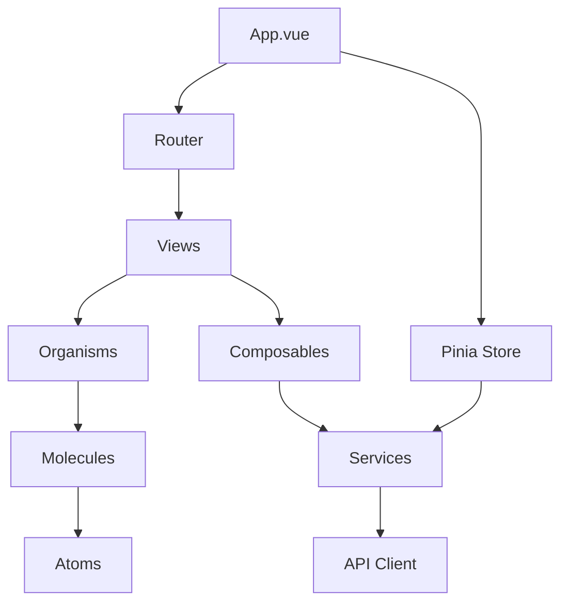
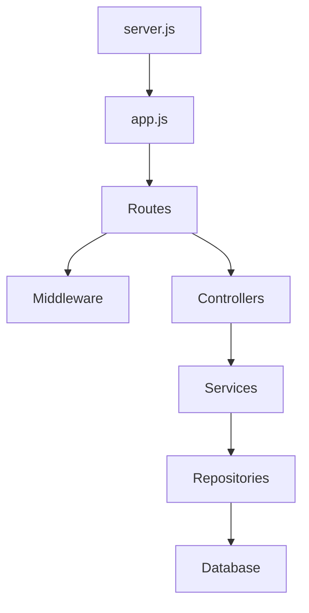

# STEREOWOOD Color System - Master Refactoring Structure

**Version:** 1.0.0  
**Date:** 2025-01-03  
**Objective:** Transform monolithic codebase into maintainable, scalable architecture

## 1. Target Architecture Overview

### 1.1 Design Principles
- **Separation of Concerns:** Clear boundaries between layers
- **Single Responsibility:** Each module has one clear purpose
- **DRY (Don't Repeat Yourself):** Eliminate code duplication
- **SOLID Principles:** Especially Open/Closed and Dependency Inversion
- **Component-Based:** Reusable, composable UI components
- **API-First:** Clear contracts between frontend and backend
- **Test-Driven:** Every module must be testable

### 1.2 High-Level Architecture

```
┌──────────────────────────────────────────────────────────────┐
│                         Frontend (SPA)                        │
├────────────────┬─────────────────┬──────────────────────────┤
│  Presentation  │  State Manager   │    Service Layer         │
│  Vue 3 + SFC   │  Pinia Stores    │    API Clients          │
└────────────────┴─────────────────┴──────────────────────────┘
                            │
                    HTTP/REST API
                            │
┌──────────────────────────────────────────────────────────────┐
│                         Backend (API)                         │
├────────────────┬─────────────────┬──────────────────────────┤
│  Controllers   │    Services      │    Repositories          │
│  Route Handlers│  Business Logic  │    Data Access           │
└────────────────┴─────────────────┴──────────────────────────┘
                            │
                    SQLite Database
```

## 2. Detailed Folder Structure

### 2.1 Complete Project Structure

```
stereowood-color-system/
├── .github/
│   ├── workflows/
│   │   ├── ci.yml                 # Continuous Integration
│   │   ├── deploy.yml             # Deployment pipeline
│   │   └── tests.yml              # Test automation
│   └── ISSUE_TEMPLATE/
│
├── frontend/
│   ├── public/
│   │   ├── index.html             # SPA entry point
│   │   └── favicon.ico
│   │
│   ├── src/
│   │   ├── assets/                # Static assets
│   │   │   ├── images/
│   │   │   └── fonts/
│   │   │
│   │   ├── components/            # Vue components (Atomic Design)
│   │   │   ├── atoms/             # Basic building blocks
│   │   │   │   ├── BaseButton.vue
│   │   │   │   ├── BaseInput.vue
│   │   │   │   ├── ColorChip.vue
│   │   │   │   └── LoadingSpinner.vue
│   │   │   │
│   │   │   ├── molecules/         # Combinations of atoms
│   │   │   │   ├── ColorCard.vue
│   │   │   │   ├── FormulaDisplay.vue
│   │   │   │   ├── SearchBar.vue
│   │   │   │   └── CategoryFilter.vue
│   │   │   │
│   │   │   ├── organisms/         # Complex components
│   │   │   │   ├── ColorList.vue
│   │   │   │   ├── ColorEditor.vue
│   │   │   │   ├── ArtworkSchemeEditor.vue
│   │   │   │   └── FormulaCalculator.vue
│   │   │   │
│   │   │   └── templates/         # Page layouts
│   │   │       ├── MainLayout.vue
│   │   │       └── PrintLayout.vue
│   │   │
│   │   ├── views/                 # Page components
│   │   │   ├── CustomColors.vue
│   │   │   ├── Artworks.vue
│   │   │   ├── MontMarte.vue
│   │   │   └── Dashboard.vue
│   │   │
│   │   ├── composables/           # Reusable composition functions
│   │   │   ├── useColors.js
│   │   │   ├── useArtworks.js
│   │   │   ├── useFormValidation.js
│   │   │   ├── useDuplicateDetection.js
│   │   │   └── useImageUpload.js
│   │   │
│   │   ├── stores/                # Pinia state management
│   │   │   ├── index.js
│   │   │   ├── colors.js
│   │   │   ├── artworks.js
│   │   │   ├── materials.js
│   │   │   └── ui.js
│   │   │
│   │   ├── services/              # API service layer
│   │   │   ├── api.js            # Axios instance & interceptors
│   │   │   ├── colorService.js
│   │   │   ├── artworkService.js
│   │   │   └── materialService.js
│   │   │
│   │   ├── utils/                 # Utility functions
│   │   │   ├── validators.js
│   │   │   ├── formatters.js
│   │   │   ├── constants.js
│   │   │   └── helpers.js
│   │   │
│   │   ├── styles/                # Global styles
│   │   │   ├── variables.scss
│   │   │   ├── mixins.scss
│   │   │   ├── base.scss
│   │   │   └── utilities.scss
│   │   │
│   │   ├── router/                # Vue Router
│   │   │   └── index.js
│   │   │
│   │   ├── App.vue                # Root component
│   │   └── main.js                # Entry point
│   │
│   ├── tests/
│   │   ├── unit/
│   │   └── e2e/
│   │
│   ├── .env.development
│   ├── .env.production
│   ├── vite.config.js             # Build configuration
│   ├── package.json
│   └── package-lock.json
│
├── backend/
│   ├── src/
│   │   ├── controllers/           # Route handlers
│   │   │   ├── colorController.js
│   │   │   ├── artworkController.js
│   │   │   ├── materialController.js
│   │   │   └── categoryController.js
│   │   │
│   │   ├── services/              # Business logic
│   │   │   ├── ColorService.js
│   │   │   ├── ArtworkService.js
│   │   │   ├── MaterialService.js
│   │   │   ├── FormulaService.js
│   │   │   └── DuplicateDetectionService.js
│   │   │
│   │   ├── repositories/          # Data access layer
│   │   │   ├── BaseRepository.js
│   │   │   ├── ColorRepository.js
│   │   │   ├── ArtworkRepository.js
│   │   │   └── MaterialRepository.js
│   │   │
│   │   ├── models/                # Data models
│   │   │   ├── Color.js
│   │   │   ├── Artwork.js
│   │   │   ├── Material.js
│   │   │   └── Scheme.js
│   │   │
│   │   ├── middleware/            # Express middleware
│   │   │   ├── auth.js
│   │   │   ├── validation.js
│   │   │   ├── errorHandler.js
│   │   │   ├── upload.js
│   │   │   └── rateLimiter.js
│   │   │
│   │   ├── validators/            # Request validation schemas
│   │   │   ├── colorValidator.js
│   │   │   ├── artworkValidator.js
│   │   │   └── common.js
│   │   │
│   │   ├── routes/                # Route definitions
│   │   │   ├── index.js
│   │   │   ├── colors.js
│   │   │   ├── artworks.js
│   │   │   └── materials.js
│   │   │
│   │   ├── database/              # Database management
│   │   │   ├── connection.js
│   │   │   ├── migrations/
│   │   │   ├── seeds/
│   │   │   └── queries/
│   │   │
│   │   ├── utils/                 # Utility functions
│   │   │   ├── logger.js
│   │   │   ├── cache.js
│   │   │   └── helpers.js
│   │   │
│   │   ├── config/                # Configuration
│   │   │   ├── database.js
│   │   │   ├── app.js
│   │   │   └── constants.js
│   │   │
│   │   └── app.js                 # Express app setup
│   │
│   ├── tests/
│   │   ├── unit/
│   │   ├── integration/
│   │   └── fixtures/
│   │
│   ├── uploads/                   # File uploads directory
│   ├── logs/                      # Application logs
│   ├── .env
│   ├── server.js                  # Server entry point
│   ├── package.json
│   └── package-lock.json
│
├── shared/                        # Shared between frontend & backend
│   ├── types/                     # TypeScript definitions (future)
│   ├── constants/
│   └── validation-schemas/
│
├── database/
│   ├── color_management.db        # SQLite database
│   ├── backups/                   # Database backups
│   └── migrations/                # Migration scripts
│
├── scripts/                       # Utility scripts
│   ├── backup.js
│   ├── restore.js
│   ├── migrate.js
│   └── seed.js
│
├── docs/
│   ├── api/                       # API documentation
│   ├── architecture/              # Architecture decisions
│   ├── deployment/                # Deployment guides
│   └── refactoring/              # Refactoring plans
│
├── docker/
│   ├── Dockerfile.frontend
│   ├── Dockerfile.backend
│   └── docker-compose.yml
│
├── .gitignore
├── .dockerignore
├── README.md
├── CHANGELOG.md
└── LICENSE
```

## 3. File Migration Mapping

### 3.1 Frontend Migrations

| Current File | Target Files | Size Estimate |
|--------------|--------------|---------------|
| **frontend/js/components/custom-colors.js** (1301 lines) | → |
| | `views/CustomColors.vue` | 150 lines |
| | `components/organisms/ColorList.vue` | 200 lines |
| | `components/organisms/ColorEditor.vue` | 180 lines |
| | `components/molecules/ColorCard.vue` | 120 lines |
| | `components/molecules/FormulaDisplay.vue` | 80 lines |
| | `composables/useColors.js` | 150 lines |
| | `stores/colors.js` | 200 lines |
| | `services/colorService.js` | 100 lines |
| | `validators/colorValidator.js` | 121 lines |
| **frontend/js/components/artworks.js** (1125 lines) | → |
| | `views/Artworks.vue` | 120 lines |
| | `components/organisms/ArtworkList.vue` | 180 lines |
| | `components/organisms/SchemeEditor.vue` | 200 lines |
| | `components/molecules/SchemeCard.vue` | 100 lines |
| | `components/molecules/LayerMapping.vue` | 150 lines |
| | `composables/useArtworks.js` | 125 lines |
| | `stores/artworks.js` | 150 lines |
| | `services/artworkService.js` | 100 lines |
| **frontend/js/components/formula-calculator.js** (630 lines) | → |
| | `components/organisms/FormulaCalculator.vue` | 200 lines |
| | `components/molecules/CalculatorInput.vue` | 100 lines |
| | `components/molecules/CalculatorResult.vue` | 80 lines |
| | `composables/useCalculator.js` | 150 lines |
| | `utils/formulaParser.js` | 100 lines |

### 3.2 Backend Migrations

| Current File | Target Files | Status |
|--------------|--------------|---------|
| **backend/routes/custom-colors.js** | → |
| | `controllers/colorController.js` | NEW |
| | `validators/colorValidator.js` | NEW |
| **backend/services/ColorService.js** | → |
| | `services/ColorService.js` | REFACTOR |
| | `repositories/ColorRepository.js` | NEW |
| **backend/db/queries/colors.js** | → |
| | `repositories/ColorRepository.js` | MERGE |
| | `database/queries/colors.sql` | NEW |

### 3.3 CSS Migrations

| Current Files | Target Structure |
|---------------|------------------|
| 11 separate CSS files | → |
| | `styles/variables.scss` - Design tokens |
| | `styles/base.scss` - Reset and defaults |
| | `styles/utilities.scss` - Utility classes |
| | Component-scoped styles in `.vue` files |

## 4. Dependency Graph

### 4.1 Frontend Dependencies



### 4.2 Backend Dependencies



## 5. Refactoring Order

### Phase 1: Foundation (Week 1)
1. Set up build tools (Vite)
2. Create folder structure
3. Install dependencies
4. Configure ESLint/Prettier
5. Set up testing framework

### Phase 2: Backend Layer (Week 2)
1. Create repository pattern
2. Refactor services
3. Implement controllers
4. Add validation middleware
5. Standardize error handling

### Phase 3: State Management (Week 3)
1. Set up Pinia
2. Create store modules
3. Migrate component state
4. Implement composables
5. Connect to services

### Phase 4: Component Decomposition (Week 4)
1. Create atomic components
2. Build molecules
3. Assemble organisms
4. Refactor views
5. Migrate templates to SFC

### Phase 5: Testing & Optimization (Week 5)
1. Unit tests for services
2. Component tests
3. Integration tests
4. Performance optimization
5. Bundle optimization

## 6. Risk Assessment

### 6.1 Migration Risks

| Component | Risk Level | Impact | Mitigation |
|-----------|------------|---------|------------|
| Custom Colors | HIGH | Core feature | Feature flag, parallel implementation |
| Artworks | HIGH | Core feature | Incremental migration |
| Database | LOW | Stable schema | No changes, only access pattern |
| API Routes | MEDIUM | Client dependencies | Versioning, backwards compatibility |
| State Management | MEDIUM | Data flow | Gradual migration with adapters |

### 6.2 Rollback Strategy

Each phase includes:
1. Git tags for rollback points
2. Database backups before changes
3. Feature flags for new code
4. Parallel old/new implementations
5. A/B testing capability

## 7. Success Criteria

### 7.1 Code Quality Metrics

- **Component Size:** No file >200 lines
- **Function Size:** No function >50 lines
- **Cyclomatic Complexity:** <10 per function
- **Test Coverage:** >80%
- **Bundle Size:** <500KB initial load
- **Load Time:** <2 seconds

### 7.2 Architecture Goals

- ✅ Complete separation of concerns
- ✅ No circular dependencies
- ✅ All state in Pinia stores
- ✅ All API calls through service layer
- ✅ All database access through repositories
- ✅ All components testable in isolation

## 8. Configuration Changes

### 8.1 New Configuration Files

```javascript
// vite.config.js
export default {
  root: './frontend',
  build: {
    outDir: '../dist',
    rollupOptions: {
      input: {
        main: resolve(__dirname, 'index.html')
      }
    }
  },
  server: {
    proxy: {
      '/api': 'http://localhost:9099'
    }
  }
}
```

### 8.2 Environment Variables

```env
# .env.production
VITE_API_URL=http://localhost:9099/api
VITE_UPLOAD_URL=http://localhost:9099/uploads
NODE_ENV=production
DB_FILE=/data/color_management.db
PORT=9099
```

## 9. Backwards Compatibility

### 9.1 API Compatibility Layer

```javascript
// Compatibility middleware
app.use('/api/*', (req, res, next) => {
  // Map old field names to new
  if (req.body.scheme_name) {
    req.body.name = req.body.scheme_name;
  }
  next();
});
```

### 9.2 Progressive Enhancement

1. New features behind feature flags
2. Gradual component replacement
3. Dual API endpoints during transition
4. Fallback to old implementation on error

## 10. Monitoring & Validation

### 10.1 Health Checks

- Component render time <100ms
- API response time <200ms
- Database query time <50ms
- Memory usage <256MB
- Error rate <1%

### 10.2 Validation Checkpoints

After each phase:
1. All existing features working
2. No performance degradation
3. No new errors in production
4. User acceptance testing passed
5. Rollback tested and verified

---

This refactoring structure ensures a systematic, low-risk transformation of the codebase while maintaining production stability. Each phase builds upon the previous, with clear rollback points and success criteria.